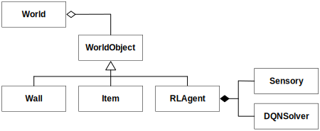
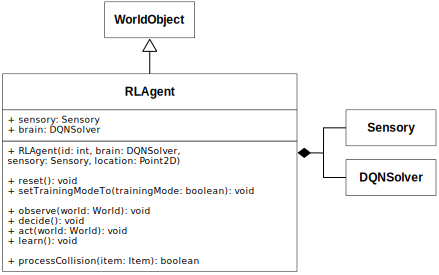

# Learning Agents Model

This repository holds the model for the *learning agents*-showcase found [here](https://mvrahden.github.io/learning-agents/).

## World Composition

The World consists of several derived subclasses of `WorldObject`.
The following UML-chart visualizes the relations between the classes.

</img>

## Agent Composition

The Agent itself is configured with a collection of sensors, the `Sensory`, and the DQN-Solver.
The Sensory helps perceiving it's environment, whereas the Solver helps to derive the right actions from its perception.
The following UML-chart shows the relations between the individual classes and gives an overview of the properties and behavior of the agent.

</img>